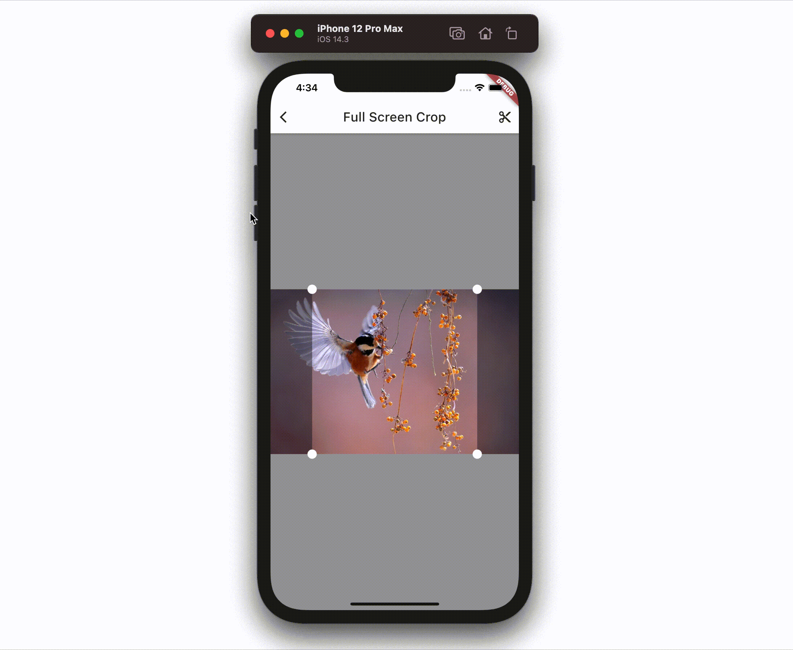
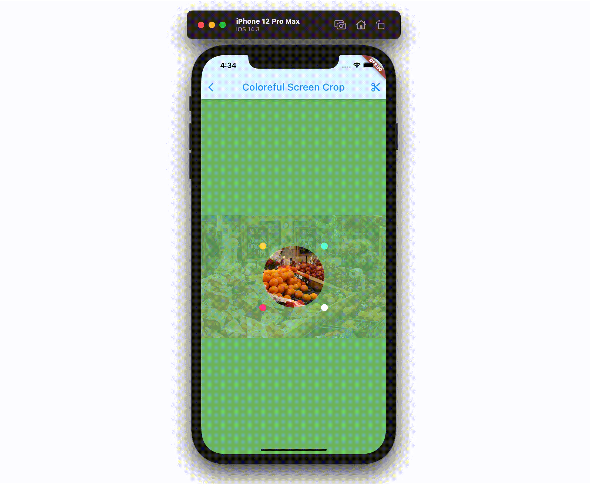
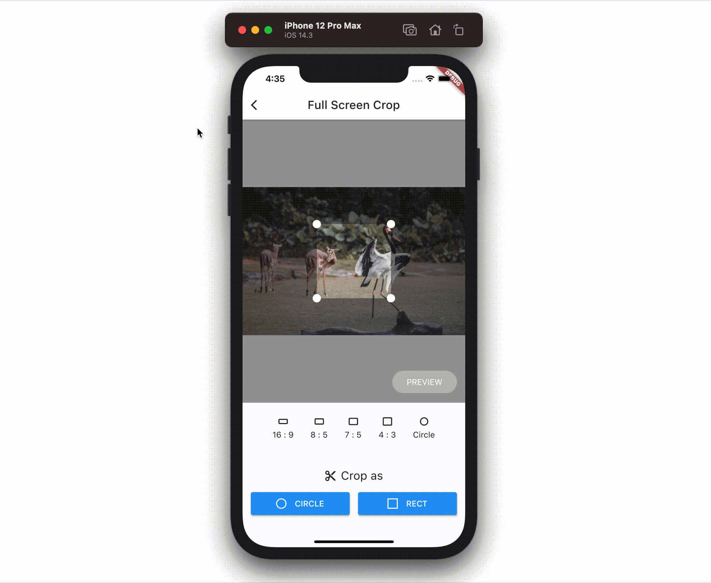

# Gallery app for crop_your_image

A sample app for Flutter cropping images package named crop_your_image.

[https://pub.dev/packages/crop_your_image](https://pub.dev/packages/crop_your_image)

I'm always waiting for your PRs adding YOUR designed page for cropping images: currently no fixed rules or templates as long as using crop_your_image package.

# How to Add Pages

## Preparation

To preparing for adding pages, you can simply clone this repository and run with whatever platform you want.

## List of the Pages

There is `lib/main.dart` which contaning `ListView` of pages.

Pages data is preserved in `List<Widget>` at the very top of `_MyHomePageState` like below.

```dart
static const pages = const [
  FullScreenCrop(),
  ColorefulScreenCrop(),
  ConfigurableCrop(),
];
```

When you add your own page, you can add one to this list and the link to that page will appear automatically.

## ImageDataNotifier

As `ImageDataNotifier` is placed at the top of Widget tree of this app, you can refer downloaded image data at whatever widgets or pages you want.

`ImageDataNotifier` simply downloads images when the app is launched and exposes the list of image data as type of `Uint8List`, named `loadData`.

Note that empty `loadData` means "still loading", so you can instantly control the UI with it.

For example:

```dart
@override
Widget build(BuildContext context) {
  final imageData = context.watch<ImageDataNotifier>();
  return Visibility(
    visible: imageData.loadData.isNotEmpty,
    child: imageData.loadData.isNotEmpty
      ? Crop(
        controller: _controller,
        image: imageData.loadData[0],
        onCropped: (cropped) {
            // any action using cropped data
        },
      )
      : const SizedBox.shrink(),
    replacement: const Center(child: CircularProgressIndicator()),
  );
)
```

# How to Make Pull Requests

There is no rule for PRs. Feel free to add your own pages and make PRs to this repository. Once your PR is merged, I would like to add its screenshot and the link to author at "Gallery" section of this README.md. Thank you.

# Gallery

## Full Screen Crop

Author: [@chooyan-eng](https://github.com/chooyan-eng)


## Colorful Screen Crop
Author: [@chooyan-eng](https://github.com/chooyan-eng)


## Configurable Crop
Author: [@chooyan-eng](https://github.com/chooyan-eng)


